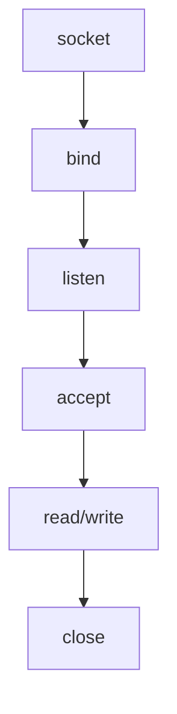
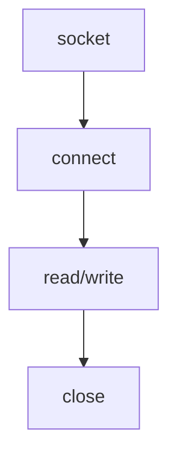

[TOC]


##### 1.基于TCP的服务器端/客户端的是实现流程

**服务器端：**



**客户端：**	




***

##### 2.socket()

socket()函数用于创建套接字

```c++
#include <sys/socket.h>
int socket(int domain, int type, int protocol);
/*
成功时返回文件描述符，失败时返回-1
domain: 套接字中使用的协议族（Protocol Family）
type: 套接字数据传输的类型信息
protocol: 计算机间通信中使用的协议信息
*/
```


* **协议族（domain字段）：**

一般选择ipv4协议族即可，即PF_INET

| 名称      | 协议族               |
| --------- | -------------------- |
| PF_INET   | IPV4 互联网协议族    |
| PF_INET6  | IPV6 互联网协议族    |
| PF_LOCAL  | 本地通信 Unix 协议族 |
| PF_PACKET | 底层套接字的协议族   |
| PF_IPX    | IPX Novel 协议族     |


* **套接字类型(type可选字段)：**

**面向连接的套接字SOCK_STREAM特征：**

可靠，有序，无数据边界（指可以多次write、read）

**面向消息的套接字SOCK_DGRAM特征：**

快速，不可靠，不一定有序，有数据边界，每次传输数据大小有限制

| 名称        | 类型                      |
| ----------- | ------------------------- |
| SOCK_STREAM | 面向连接的套接字，用于TCP |
| SOCK_DGRAM  | 面向消息的套接字，用于UDP |


* **协议的最终选择（protocol字段):**

IPV4加上套接字类型即可唯一确定传输协议了，因此默认填0即可

| 名称        | 类型    |
| ----------- | ------- |
| IPPROTO_TCP | 用于TCP |
| IPPROTO_UDP | 用于UDP |


***

##### 3.bind()

bind()函数用于给套接字分配地址

```c++
#include <sys/socket.h>
int bind(int sockfd, struct sockaddr *myaddr, socklen_t addrlen);
//成功时返回0，失败时返回-1
```


* **sockfd参数：**

即通过socket创建返回的套接字id


* **myaddr参数：**

ipv4一般使用sockaddr_in结构体会比较方便，调用方法如：

```c++
sockaddr_in serv_addr;

//初始化serv_addr一系列操作

if (bind(fd, (struct sockaddr *)&serv_addr, sizeof(serv_addr)) == -1) {
  error_handling("bind() error");
}
```


* **addrlen参数：**

返回`sockaddr_in`对象的大小即可


##### 4.sockaddr_in相关初始化

在初始化之前记得将所有成员初始化为0，即

```c++
sockaddr_in addr;
memset(&addr, 0, sizeof(addr));
```


结构体的定义如下：

```c
struct sockaddr_in
{
    sa_family_t sin_family;  //地址族（Address Family）
    uint16_t sin_port;       //16 位 TCP/UDP 端口号
    struct in_addr sin_addr; //32位 IP 地址
    char sin_zero[8];        //不使用
};
```

该结构体中提到的另一个结构体 in_addr 定义如下，它用来存放 32 位IP地址

```c
struct in_addr
{
    in_addr_t s_addr; //32位IPV4地址
}
```


* **成员 sin_family**

每种协议适用的地址族不同，比如，IPV4 使用 4 字节的地址族，IPV6 使用 16 字节的地址族。

| 地址族（Address Family） | 含义                               |
| ------------------------ | ---------------------------------- |
| AF_INET                  | IPV4用的地址族                     |
| AF_INET6                 | IPV6用的地址族                     |
| AF_LOCAL                 | 本地通信中采用的 Unix 协议的地址族 |


* **成员 sin_port**

在网络传输中，`sin_port`和`sin_addr`都以网络字节序保存

帮助转换字节序的函数：

```c
unsigned short htons(unsigned short);
unsigned short ntohs(unsigned short);
unsigned long htonl(unsigned long);
unsigned long ntohl(unsigned long);


- htons 的 h 代表主机（host）字节序。
- htons 的 n 代表网络（network）字节序。
- s 代表 short    16位
- l 代表 long			32位
```

通常调用方式为：

```c++
char *serv_port = "9190";
...
serv_addr.sin_port = htons(atoi(serv_port));
```


* **成员sin_addr**

可以看到它是属于结构体`struct addr_in`，里面有一个`in_addr_t`类型的变量

存在函数可以帮助我们将字符串的ip地址转化为32位的`in_addr_t`

```c++
#include <arpa/inet.h>
in_addr_t inet_addr(const char *string);
//成功时返回32位网络字节序，失败返回INADDR_NONE
```


还有函数也能够实现，且使用频率更高：

```c++
#include <arpa/inet.h>
int inet_aton(const char *string, struct in_addr *addr);
/*
成功时返回 1 ，失败时返回 0
string: 含有需要转换的IP地址信息的字符串地址值
addr: 将转换后的结果存入到addr中
*/

#include <arpa/inet.h>
char *inet_ntoa(struct in_addr adr);
/*
该函数将通过参数传入的整数型IP地址转换为字符串格式并返回。但要小心，返回值为 char 指针，返回字符串地址意味着字符串已经保存在内存空间，但是该函数未向程序员要求分配内存，而是再内部申请了内存保存了字符串。也就是说调用了该函数候要立即把信息复制到其他内存空间。因此，若再次调用 inet_ntoa 函数，则有可能覆盖之前保存的字符串信息。总之，再次调用 inet_ntoa 函数前返回的字符串地址是有效的。若需要长期保存，则应该将字符串复制到其他内存空间。
总之就是多次调用，需要保存前一次的值
*/
```


**推荐写法：**

大多数情况下利用常数`IADDR_ANY`来自动分配服务器端的ip地址，会方便很多

```c++
serv_addr.sin_addr.s_addr = htonl(INADDR_ANY);
```


* **成员sinzero**

无特殊含义，必须被填充为0，因此在一开始建议调用

```c++
memset(&addr, 0, sizeof(addr));
```


***

##### 5.listen()

```c
#include <sys/socket.h>
int listen(int sockfd, int backlog);
//成功时返回0，失败时返回-1
//sock: 希望进入等待连接请求状态的套接字文件描述符，传递的描述符套接字参数称为服务端套接字
//backlog: 连接请求等待队列的长度，若为5，则队列长度为5，表示最多使5个连接请求进入队列      
```


##### 6.accept()

```c
#include <sys/socket.h>
int accept(int sockfd, struct sockaddr *addr, socklen_t *addrlen);
/*
成功时返回文件描述符，失败时返回-1
sock: 服务端套接字的文件描述符
addr: 保存发起连接请求的客户端地址信息的变量地址值
addrlen: 的第二个参数addr结构体的长度，但是存放有长度的变量地址。
*/
```


##### 7.connect()

```c
#include <sys/socket.h>
int connect(int sock, struct sockaddr *servaddr, socklen_t addrlen);
/*
成功时返回0，失败返回-1
sock:客户端套接字文件描述符
servaddr: 保存目标服务器端地址信息的变量地址值
addrlen: 以字节为单位传递给第二个结构体参数 servaddr 的变量地址长度
*/
```


##### 8.read() / write()

```c
#include <unistd.h>
ssize_t read(int fd, void *buf, size_t nbytes);
/*
成功时返回接收的字节数（但遇到文件结尾则返回 0），失败时返回 -1
fd : 显示数据接收对象的文件描述符
buf : 要保存接收的数据的缓冲地址值。
nbytes : 要接收数据的最大字节数
*/


#include <unistd.h>
ssize_t write(int fd, const void *buf, size_t nbytes);
/*
成功时返回写入的字节数 ，失败时返回 -1
fd : 显示数据传输对象的文件描述符
buf : 保存要传输数据的缓冲值地址
nbytes : 要传输数据的字节数
*/
```


