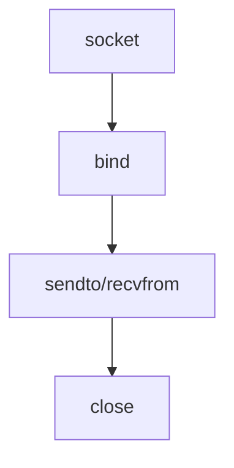
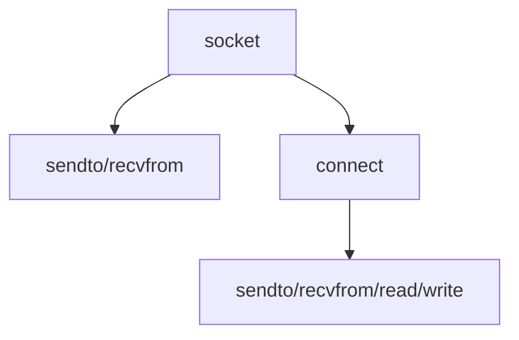

[TOC]


### 1.udp服务端/客户端基本流程

udp不需要经历连接的过程，也就是说不必调用TCP连接过程中调用的listen函数和accept函数，udp只有创建套接字和数据交换的过程。

udp服务器端可以实现一对多通信

**服务端：**



**客户端：**

客户端可以直接传送数据，但是每次sendto都会向udp套接字中注册**目标**ip和端口号，因此对于长时间通信的双方来说，使用已连接的udp套接字会提高效率。

已连接通过connect函数实现

针对 UDP 调用 connect 函数并不是意味着要与对方 UDP 套接字连接，这只是向 UDP 套接字注册目标IP和端口信息。

之后就与 TCP 套接字一致，每次调用 sendto 函数时只需传递信息数据。因为已经指定了收发对象，所以不仅可以使用 sendto、recvfrom 函数，还可以使用 write、read 函数进行通信。




***

##### 1.1 sendto() / recvfrom()

```c
#include <sys/socket.h>
ssize_t sendto(int sock, void *buff, size_t nbytes, int flags,
               struct sockaddr *to, socklen_t addrlen);
/*
成功时返回传输的字节数，失败是返回 -1
sock: 用于传输数据的 UDP 套接字
buff: 保存待传输数据的缓冲地址值
nbytes: 待传输的数据长度，以字节为单位
flags: 可选项参数，若没有则传递 0
to: 存有目标地址的 sockaddr 结构体变量的地址值
addrlen: 传递给参数 to 的地址值结构体变量长度
*/


#include <sys/socket.h>
ssize_t recvfrom(int sock, void *buff, size_t nbytes, int flags,
                 struct sockaddr *from, socklen_t *addrlen);
/*
成功时返回传输的字节数，失败是返回 -1
sock: 用于传输数据的 UDP 套接字
buff: 保存待传输数据的缓冲地址值
nbytes: 待传输的数据长度，以字节为单位
flags: 可选项参数，若没有则传递 0
from: 存有发送端地址信息的 sockaddr 结构体变量的地址值
addrlen: 保存参数 from 的结构体变量长度的变量地址值。
*/
```


##### 1.2 何时分配本机ip和端口

客户端TCP套接字调用 connect 函数时自动分配IP和端口号

客户端UDP在首次调用 sendto 函数时自动给相应的套接字分配IP和端口号。而且此时分配的地址一直保留到程序结束为止


### 2.udp多播---Multicast

通俗点讲，多播也称组播，大概可以理解为分组广播的意思，是介于单播和广播之间的一种通信机制，使用多播方式，可以实现对局域网内一组特定的主机进行通信，对局域网节点分组，加入该分组即可接收该分组的消息，而未加入分组则收不到消息。


##### 2.1 多播地址划分

> 摘自：https://blog.csdn.net/li_wen01/article/details/70048172
>
>  多播的地址是特定的，D类地址用于多播。D类IP地址就是多播IP地址，即224.0.0.0至239.255.255.255之间的IP地址，并被划分为局部连接多播地址、预留多播地址和管理权限多播地址3类：
>
> 局部多播地址：在224.0.0.0～224.0.0.255之间，这是为路由协议和其他用途保留的地址，路由器并不转发属于此范围的IP包。
>
>  预留多播地址：在224.0.1.0～238.255.255.255之间，可用于全球范围（如Internet）或网络协议。
>
> 管理权限多播地址：在239.0.0.0～239.255.255.255之间，可供组织内部使用，类似于私有IP地址，不能用于Internet，可限制多播范围。


##### 2.2 多播编程实现流程

```c
1. 建立套接字接口  
2. 设置套接字属性
3. 加入特定的多播组
4. 发送/接收信息
5. 离开多播组
6. 关闭套接字
* 若只是发信息，可不用加入组，直接向该组发送信息即可
```


##### 2.3 相关套接字设置

```c
1.  IP_MULTICASE_TTL (发送端设置)
    设置超时时间， 范围是0~255
  
2.  IP_MULTICAST_IF
    指定使用的网络接口，如果主机有多个网络接口，不设置该选项则使用默认接口发送接收，使用该选项可指定某特定网络接口发送和接收信息
  
3. IP_MULTICAST_LOOP
    设置是否晕熏数据发送到本地loop地址，即127.0.0.1
  
4. IP_ADD_MEMBERSHIP/IP_DROP_MEMBERSHIP
    加入/离开特定的多播组， 操作一个struct ip_mreq结构体，里面包含带加入/离开组的信息
```


#####  2.4 注意事项

1. 如果只是发送多播消息，不必加入多播组，直接调用sendto发往多播IP即可
2. 发送端和接收端共用一个端口
3. 多个接收端接收多播消息，记得在bind之前开启端口复用
4. 多播默认消息会发往本地loop地址，要取消的话记得设置


### 3.udp广播

广播（Broadcast）在「一次性向多个主机发送数据」这一点上与多播类似，但传输数据的范围有区别。多播即使在跨越不同网络的情况下，只要加入多播组就能接受数据。相反，广播只能向同一网络中的主机传输数据。

##### 3.1 广播ip

广播是向同一网络中的所有主机传输数据的方法。与多播相同，广播也是通过 UDP 来完成的。根据传输数据时使用的IP地址形式，广播分为以下两种：

- 直接广播（Directed Broadcast）
- 本地广播（Local Broadcast）

二者在实现上的差别主要在于IP地址。直接广播的IP地址中除了网络地址外，其余主机地址全部设置成 1。例如，希望向网络地址 192.12.34 （C类网络） 中的所有主机传输数据时，可以向 192.12.34.255 传输。换言之，可以采取直接广播的方式向特定区域内所有主机传输数据。

反之，本地广播中使用的IP地址限定为 255.255.255.255 。例如，192.32.24 网络中的主机向 255.255.255.255 传输数据时，数据将传输到 192.32.24 网络中所有主机。


##### 3.2 实现

在发送方设置socket属性SO_BROADCAST即可

数据通信中使用的IP地址是与 UDP 示例的唯一区别：默认生成的套接字会阻止广播，因此，只需通过如下代码更改默认设置

```c
int send_sock;
int bcast = 1;
...
send_sock=socket(PF_INET,SOCK_DGRAM,0);
...
setsockopt(send_sock,SOL_SOCKET,SO_BROADCAST,(void*)&bcast,sizeof(bcast));
...
```


