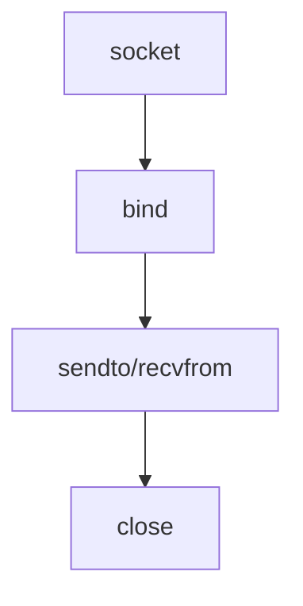
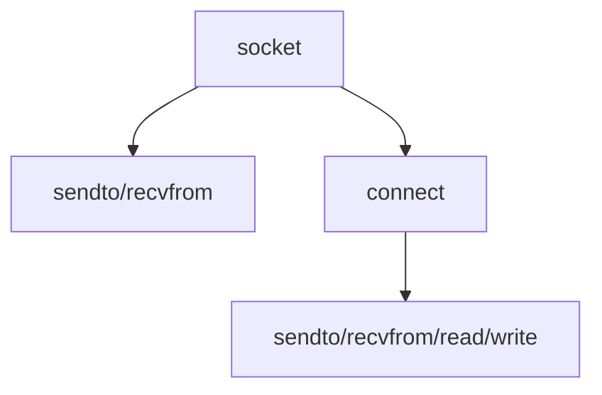

[TOC]


##### 1.udp服务端/客户端基本流程

udp不需要经历连接的过程，也就是说不必调用TCP连接过程中调用的listen函数和accept函数，udp只有创建套接字和数据交换的过程。

udp服务器端可以实现一对多通信

**服务端：**



**客户端：**

客户端可以直接传送数据，但是每次sendto都会向udp套接字中注册**目标**ip和端口号，因此对于长时间通信的双方来说，使用已连接的udp套接字会提高效率。

已连接通过connect函数实现

针对 UDP 调用 connect 函数并不是意味着要与对方 UDP 套接字连接，这只是向 UDP 套接字注册目标IP和端口信息。

之后就与 TCP 套接字一致，每次调用 sendto 函数时只需传递信息数据。因为已经指定了收发对象，所以不仅可以使用 sendto、recvfrom 函数，还可以使用 write、read 函数进行通信。




***

##### 2.sendto() / recvfrom()

```c
#include <sys/socket.h>
ssize_t sendto(int sock, void *buff, size_t nbytes, int flags,
               struct sockaddr *to, socklen_t addrlen);
/*
成功时返回传输的字节数，失败是返回 -1
sock: 用于传输数据的 UDP 套接字
buff: 保存待传输数据的缓冲地址值
nbytes: 待传输的数据长度，以字节为单位
flags: 可选项参数，若没有则传递 0
to: 存有目标地址的 sockaddr 结构体变量的地址值
addrlen: 传递给参数 to 的地址值结构体变量长度
*/


#include <sys/socket.h>
ssize_t recvfrom(int sock, void *buff, size_t nbytes, int flags,
                 struct sockaddr *from, socklen_t *addrlen);
/*
成功时返回传输的字节数，失败是返回 -1
sock: 用于传输数据的 UDP 套接字
buff: 保存待传输数据的缓冲地址值
nbytes: 待传输的数据长度，以字节为单位
flags: 可选项参数，若没有则传递 0
from: 存有发送端地址信息的 sockaddr 结构体变量的地址值
addrlen: 保存参数 from 的结构体变量长度的变量地址值。
*/
```


##### 3.何时分配本机ip和端口

客户端TCP套接字调用 connect 函数时自动分配IP和端口号

客户端UDP在首次调用 sendto 函数时自动给相应的套接字分配IP和端口号。而且此时分配的地址一直保留到程序结束为止